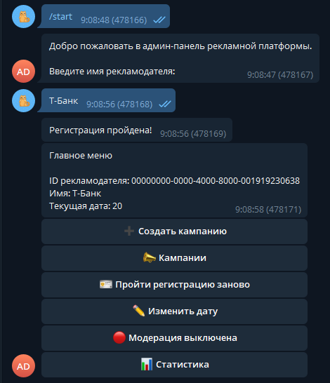

# PROD’25: рекламная платформа

[](https://wakatime.com/badge/user/4d307129-8091-44ba-9099-161f9a292e0d/project/33e9c5d2-08f2-4533-8f5d-06c8f62f8cb3)

Это решение кейса индивидуального тура для [олимпиады PROD](https://prodcontest.ru) на языках Go и Python. Задание доступно в папке [media/task](media/task).

# Запуск

Перед запуском нужно создать файл `secrets/admin_bot_token.txt` и добавить токен бота из [@BotFather](https://t.me/BotFather).

Docker:
```bash
docker-compose up -d
```

Будет запущено несколько контейнеров, полный список - в разделе Документация.

Приложение будет запущено под портом 8080. Получить доступ к нему можно по адресам:
- API: http://localhost:8080
- Swagger UI: http://localhost:8080/docs (или в GitLab: [backend/docs/swagger.yaml](backend/docs/swagger.yaml))
- Grafana: http://localhost:8080/grafana/dashboards

## Команды Makefile

- `make lint` - проверка кода и форматирования (требует установленного Go и Python с ruff)
- `make test` - поднимает приложение и запускает unit- и интеграционные тесты (требует установленного Go и Python с tavern). Подробнее в [Тесты](#Тесты)
- `make up` - поднимает приложение при помощи docker-compose
- `make docs` - создаёт документацию при помощи [swag](https://github.com/swaggo/swag) (требует установленного Go)
- `make data` - генерирует данные для тестирования визуализации. Подробнее в [Тесты](#Тесты)
- `make views` - генерирует просмотры для тестирования статистики в Телеграм-боте. Подробнее в [Интеграция с tg ботом](#Интеграция-с-tg-ботом)

## Демонстрация работы

### API

После запуска Swagger UI будет доступен по адресу http://localhost:8080/docs/index.html


### Телеграм-бот

Регистрация



Создание кампаний


Генерация текста через LLM


Редактирование кампаний


Статистика в боте


### Статистика (дашборды в Grafana)


## Описание работы основных точек входа

### Алгоритм подбора рекламы

Работает в 2 шага:

1. Подбор кандидатов. При помощи [SQL-запроса](backend/internal/repo/campaign.go) сервер получает список кампаний,
которые потенциально могут быть показаны пользователю. На этом этапе происходит фильтрация по датам кампании,
таргетингу и превышению лимита (кампания не попадёт в список кандидатов, если количество показов превышает лимит больше, чем на 4%);
2. Ранжирование. Функция [chooseAdCandidate](backend/internal/service/ad.go) сортирует список путём попарной оценки каждой рекламы.
Потенциальная прибыль от показа имеет вес 0.33, прибыль от клика - 0.33, ML score - 0.33 (пропорционально критериям).
Топ-1 кандидат отображается пользователю. При следующем запросе порядок кандидатов изменится, 
так как факт уже совершённого просмотра/клика влияет на потенциальную прибыль.

# Опциональные функциональные требования

## Добавление изображений в рекламных объявлениях

Тег в Swagger: `Images`

В созданную кампанию можно загрузить изображение размером до 5 МБ и форматом .jpg или .png.
После загрузки поле `image_path` сменится с пустой строки на путь вида `"/media/abcdef.png"`.
Он относителен касательно base url (`http://localhost:8080`), т.е. скачать файл 
можно по ссылке вида `http://localhost:8080/media/abcdef.png`.
Изображения отображаются клиентам при просмотре рекламы.

Изображения сохраняются в именованном volume `media`, который подключен к двум контейнерам - `backend` и `nginx`.
Запросы на /media не проксируются к бэкенду, а обрабатываются напрямую nginx.

## Визуализация статистики

В этом проекте как средство визуализации используется Grafana, которая доступна по адресу http://localhost:8080/grafana.
Доступ открыт без авторизации (на случай, если потребуется — логин `admin` и пароль `admin`).

Список дашбордов:
1. [Реклама](http://localhost:8080/grafana/d/bedpya379dbeof/reklama) - просмотры и клики по рекламе, а так же сопутствующие доходы
2. [API](http://localhost:8080/grafana/d/dedlu0yqeqnlsd/api) - нагрузка на API
3. [Ответы LLM](http://localhost:8080/grafana/d/cedlpjse29logf/otvety-llm) - запросы к LLM

Чтобы заполнить их данными, можно запустить `make data` - см. [Тесты](#Тесты).

## Интеграция с tg ботом

Бот написан на Python с использованием библиотек `aiogram` и `aiogram_dialog`.
Токен бота хранится в [secrets/admin_bot_token.txt](secrets/admin_bot_token.txt)
и загружается при помощи [Docker secrets](https://docs.docker.com/compose/how-tos/use-secrets/).

При первом запуске необходимо пройти регистрацию из одного этапа: ввода названия рекламодателя.
В боте доступно создание, просмотр и обновление кампаний, просмотр статистики (как одной кампании, так и всего рекламодателя),
а так же сервисные функции по типу включения/выключения модерации и изменения текущей даты.

Если кампания не прошла модерацию, это отобразится в интерфейсе:


Бот взаимодействует только с API и не использует базу данных (кроме Redis для сохранения состояния диалога после перезагрузки).

Чтобы заполнить БД просмотрами рекламы для тестирования статистики, можно запустить `make views`
(нужно иметь созданную кампанию). При запуске скрипт запросит UUID рекламодателя, который доступен на главной бота.

## Интеграция с LLM для генерации рекламных текстов

Тег в Swagger: `AI`

Я выбрал модель [gemma2 (версия на 2.6B параметров)](https://ollama.com/library/gemma2:2b), которая запущена локально
в контейнере ollama. При использовании она потребляет около 4 ГБ ОЗУ (и я установил жёсткое ограничение в 6 ГБ
в docker-compose.yml), что подходит под ограничение в 8 ГБ на всё приложение.

При запуске (кроме случая, когда приложение запущено в CI) бэкенд отправляет в Ollama
запрос на скачивание модели - это займёт 1-2 минуты.
Если в это время создать задачу на генерацию, она будет ждать окончания инициализации.

Для создания рекламного текста используется метод `POST /ai/advertisers/{advertiserId}/suggestText`.
Этот метод добавляет задачу в сервис AI (см. [backend/internal/service/ai.go](backend/internal/service/ai.go)).
Обычно на генерацию уходит до 30 секунд.
Результат можно получить с помощью метода `GET /ai/tasks/{taskId}` (подразумевается использовать short-polling с интервалом от 2 секунд).

## Модерация текстов рекламных кампаний

Тег в Swagger: `Moderation`

Модерацию можно включить и выключить по методу `POST /ai/moderation/enabled`. По умолчанию она выключена.

В моём решении модерация несёт рекомендательный характер. Она уведомляет рекламодателя о наличии нарушения, 
а так же позволяет администрации сайта получить список всех "проблемных" кампаний при помощи `GET /ai/moderation/failed`.

Для модерации кампаний так же используется LLM.
Если модерация включена, то после создания или обновления любой кампании создаётся задача на модерацию в сервис AI.
Через некоторое время (около 20-30 секунд) поле `moderation_result` у модели Campaign сменяется с null на объект
с результатами проверки с полями `acceptable` и `reason` (если acceptable = false).
Потенциально, можно исключать кампании, не прошедшие модерацию, из списка реклам-кандидатов - это делается обновлением SQL-запроса.

# Нефункциональные требования

## Тесты

Запуск тестов:
```bash
make test
```

Эта команда поднимает приложение (аналогично `make up`) и запускает unit- и интеграционные тесты.

### Unit-тесты

Ими покрыта часть бизнес-логики, а так же весь код, который экспортирован для использования в других проектах (в папке [backend/pkg](backend/pkg)).

Для запуска нужно иметь Go 1.23+ и скачать зависимости при помощи `go mod download`.

### Интеграционные тесты

Находятся в папке [backend/tests](backend/tests). Они покрывают всю функциональность приложения.
Как на 2 этапе олимпиады, тесты разбиты на группы, каждая из них тестирует какую-то группу эндпоинтов.

Каждый из тестов написан так, что его можно запустить независимо от других, а так же выполнять несколько раз подряд.
Однако некоторые из тестов требуют чистую базу данных (это будет понятно по ошибке в логах) -
выполните `docker-compose down`, удалите volume `postgres_data` и запустите приложение заново.

Тесты `test_10_campaign_moderation.tavern.yaml` и `test_11_ai_suggestions.tavern.yaml` используют LLM, поэтому 
выполняются дольше других. Может показаться, что логи засыпаны ошибками - это нормально (Tavern делает повторные запросы,
имитируя short-polling).

Для запуска нужно иметь Python и скачать зависимости при помощи `pip install -r backend/tests/requirements.txt`.

`make data` запустит стресс-тест (`test_07_stress_ads.py`) без очистки данных после завершения -
это можно использовать, чтобы заполнить БД данными для просмотра статистики в Grafana.

## Используемые технологии и обоснование

- Docker и docker-compose: развёртывание приложения с гарантией идентичности результата на разных окружениях;
- [Gin](https://github.com/gin-gonic/gin): популярный и быстрый фреймворк для Go;
- PostgreSQL: все DTO в этом проекте - структурированы и подходят для хранения в реляционной базе данных.
PostgreSQL - мощная и надёжная СУБД, которая хорошо подходит под требования по скорости ответов;
- [Ollama](https://github.com/ollama/ollama): при её помощи можно использовать LLM бесплатно и полностью локально,
за счёт чего можно писать более качественные интеграционные тесты и запускать приложение без интернета. Как модель я
выбрал gemma2:2b, поскольку она удовлетворяла ограничениям по ОЗУ и даёт качественные ответы на русском языке;
- Nginx: проксирует запросы к бэкенду и Grafana (позволяя использовать один порт вместо двух), а так же раздаёт медиа-файлы.
- Grafana: open-source инструмент для визуализации статистики с большим разнообразием графиков;
- Aiogram: самая известная и наиболее развитая библиотека для Telegram-ботов на Python с поддержкой асинхронности;
- Aiogram_dialog: GUI-фреймворк на базе aiogram, позволяющий существенно сократить дублирование кода
и перейти от императивного стиля разработки к декларативному;
- Redis: легковесная СУБД, которую использует aiogram для сохранения состояний диалога.

## Архитектура контейнеров


За счёт того, что LLM запускается в контейнере, весь бэкенд работает без доступа к интернету.
Телеграм-бот является клиентом API и взаимодействует только с ним, без прямого доступа к базе данных.

## Схема данных СУБД


В таблице api_requests сохраняется каждый запрос к API. Это поведение отключено при запуске в CI.
